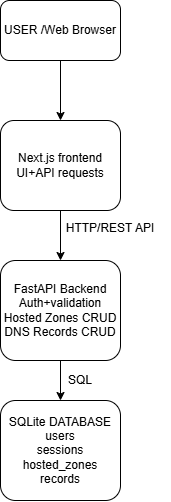

# AWS Route 53 Clone

A functional AWS Route 53 console clone developed for the Scaler SDE Fullstack assignment.

The application recreates core Route 53 hosted zone and DNS record management workflows with a Next.js frontend, FastAPI backend, and SQLite database.


## Stack
- Frontend: Next.js 14 + React + TypeScript
- Backend: FastAPI + Pydantic
- Database: SQLite
- Authentication: mocked IAM-style login with expiring bearer sessions

## Implemented assignment scope
- Login, logout, session persistence
- Hosted Zone list/search/filter/pagination
- Public and private Hosted Zone creation
- Hosted Zone edit/delete
- Automatic NS + SOA records
- DNS record CRUD for A, AAAA, CNAME, TXT, MX, NS, PTR, SRV and CAA
- Record search/filter/pagination
- Bulk record deletion
- JSON and BIND export
- BIND import
- Route 53-style navigation, tables, forms, modals and notifications
- Dashboard / Traffic Policies / Health Checks / Resolver / Profiles placeholders
- Dark mode
- Keyboard shortcuts: Ctrl/Cmd+K focuses search; N opens Create Hosted Zone outside form fields
- Server-side validation and protected NS/SOA records
- SQLite persistence



## Run backend
Windows PowerShell:

```powershell
cd backend
python -m venv .venv
.\.venv\Scripts\Activate.ps1
pip install -r requirements.txt
python -m uvicorn main:app --reload
```

API docs: http://127.0.0.1:8000/docs

## Run frontend

```powershell
cd frontend
npm install
npm run dev
```

Open: http://localhost:3000

Demo login:
- Username: `admin`
- Password: `admin123`

## Database
`backend/route53.db` is generated automatically on first backend startup. It is intentionally ignored by Git.

## Database schema
`users` stores the demo account; `sessions` stores expiring bearer sessions; `hosted_zones` stores zone metadata; `records` stores DNS record sets with a foreign key back to the zone and a unique `(zone_id, name, type)` constraint.


## API overview
- `POST /api/auth/login`
- `POST /api/auth/logout`
- `GET /api/auth/me`
- `GET/POST /api/hosted-zones`
- `GET/PUT/DELETE /api/hosted-zones/{id}`
- `GET/POST /api/hosted-zones/{id}/records`
- `PUT/DELETE /api/hosted-zones/{id}/records/{rid}`
- `POST /api/hosted-zones/{id}/records/bulk-delete`
- `GET /api/hosted-zones/{id}/export?format=json|bind`
- `POST /api/hosted-zones/{id}/import-bind`

## Demo

**Live Demo:** [AWS Route 53 Clone](https://route53-clone-ivory.vercel.app/login)

## Notes
This project recreates Route 53 workflows and UI patterns; it does not perform real DNS hosting or AWS API operations, matching the assignment's stated scope.
